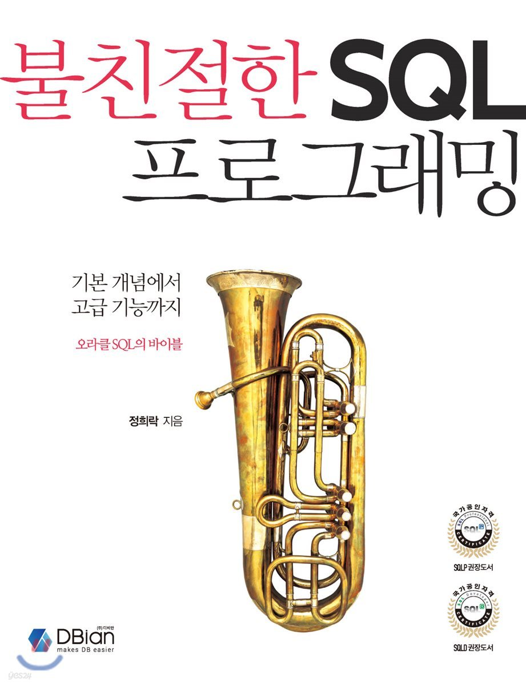

# 📖 Book Session - 불친절한 SQL 프로그래밍

> Oracle 데이터베이스의 기초부터 심화까지 공부하고, SQLP 시험을 대비하기 위한 스터디입니다.

 

 

## 🙌 How to Study

- 매주 60p 정도의 Chapter를 읽습니다.
- 배운 내용과 작성한 쿼리를 정리하여 git 에 올립니다. 기술 불로그 작섣을 권장합니다.

## 📆 Schedule

| Round | Date       | Scope        | Done |
|-------|------------|--------------|------|
| 1     | 2024.09.05 | Chapter 1~5  | ✅    |
| 2     | 2024.09.23 | chapter 6    | ✅    |
| 3     | 2024.10.01 | chapter 7    | ✅    |
| 4     | 2024.10.15 | chapter 8~10 | ✅   |
| 5     | 2024.11.10 | chapter 11~12 |    |

## 🚦Rules

### Commit Message

- `docs: {something}`: `README` 등 문서 수정
- `present: {title, chapterName, ...}`: 발표자료 업로드
- `comment: {title, chapterName, ...}`: 정리, 공유할 내용 등 스터디를 위한 기록물

 

## 😀 스터디 참여자

<table>

<tr>
  <td align=center>
  <a href="https://github.com/aihoshistar">
  
   
  Back-end 🖥
   
  aihoshistar
  </a>
  </td>

  <td align=center>
  <a href="https://github.com/newbieJanghan">
  
   
  Back-end 🖥
   
  newbieJanghan
  </a>
  </td>

  <td align=center>
  <a href="https://github.com/ghlnh">
  
   
  Back-end 🖥
   
  ghlnh
  </a>
  </td>
</tr>

</table>

 

