# 1장 기본개념

## 1.1 데이터

정량적 데이터는 구조화되어 저장되기 때문에 정형(struictured) 데이터, 정성적 데이터는 반대의 의미로 비정형(unstructured) 데이터라고 부른다. 이런 이유로 정량적 데이터 분석을 정형 분석, 정성적 데이터 분석을 비정형 분석으로 부르기도 한다. SQL은 정형 분석에 사용되는 프로그래밍 언어다.

## 1.2 데이터베이스

관계형 모델은 릴레이션(relation)에 데이터를 저장한다. 릴레이션은 아래 그림처럼 2차원 형태의 표로 구성된다. 릴레이션은 튜플(tuple)의 집합이며, 튜플은 속성(attribute)의 집합이다

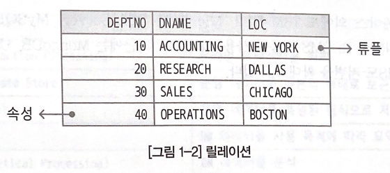

## 1.4 IT 시스템

IT 시스템은 데이터의 발생 유형과 사용 목적에 따라 운영 시스템, EDW 영역, BI 영역으로 구 분된다. 운영 시스템에서 발생한 데이터는 BDW 영역을 거쳐 BI 영역으로 이동한다.

| 영역 | 목적 |
| --- | --- |
| 운영 시스템(Operational System) | 기업 운영에 필요한 데이터를 관리 |
| EDW(Enterprise DAta Warehouse) | 분석을 위한 데이터를 저장 |
| BI(Business Intelligence) | 기업의 효율적인 의사 결정을 지원 |

각각의 시스템도 운영 목적이 다르다. 운영 목적이 다르기 때문에 사용하는 SQL의 유형도 다르다. OLTP시스템은 응답 속도가 빠른 Top-N 쿼리, DW시스템은 처리량이 많은 집계 쿼리의 비중이 높다.

| 시스템 | 목적 |
| --- | --- |
| OLTP | 온라인 트랜잭션을 처리 |
| ODS | 운영 데이터를 원본의 형태로 보관 |
| DW | 운영 데이터를 통일된 형식으로 저장 |
| DM | DW데이터를 사용 목적에 따라 요약 |

---

# 2장 데이터 모델링

## 2.1 데이터 모델

데이터 모델은 상세화 수준에 따라 개념(conceptual) 데이터 모델, 논리(logical) 데이터 모델, 물리 (physical) 데이터 모델로 구분된다. 요구사항을 분석하여 개념 데이터 모델을 설계하고, 데이터 베이스 모델에 따라 개념 데이터 모델을 논리 데이터 모델로 상세화한 후, DBMS에 따라 논리 데이터 모델을 물리 데이터 모델로 전환한다.

데이터베이스 모델과 데이터 모델은 상이한 개념이다. 데이터베이스 모델이 건축물의 유형(초가집, 통나무 집, 벽돌집)이라면, 데이터 모델은 건축물의 설계도로 비유할 수 있다.

## 2.2 E-R 모델

| E-R모델 | 관계형 모델 | 오라클 데이터베이스 |
| --- | --- | --- |
| 엔터티 | 릴레이션(relation) | 테이블 |
| 인스턴스 | 튜플(tuple) | 행 |
| 속성 | 속성(attribute) | 열 |

### 2.2.2 속성

속성(attribute)은 엔터티에서 관리되는 데이터의 최소 단위다. 속성은 업무적으로 분리되지 않아야 하며 하나의 속성값만 가져야 한다. 전화번호는 하나의 속성으로 설계되는 것이 일반적이지만 통신사의 경우 지역번호, 국번호, 개별번호로 분리하여 설계하기도 한다.

### 2.2.2.1 도메인

도메인은 속성값의 범위를 나타낸다. 물리 모델에서 데이터 타입과 제약 조건으로 변환된다

### 2.2.3 관계

관계(relationship)는 엔터티 간의 업무적 연관이다. 하나의 엔터티는 하나 이상의 관계를 가질 수 있고, 관계를 가진 엔터티와 또 다른 관계를 가질 수도 있다.

아래 그림의 부서 엔터티와 사원엔터티는 관계를 가진다. 이때 부서 엔터티를 부모 엔터티, 사원 엔터티를 자식 엔터티라고 한다. 자식의 엔터티는 부모의 엔터티의 기본 식별자를 상속받는다. 부모 엔터티로부터 상속받은 식별자를 외래 식별자라고 한다.

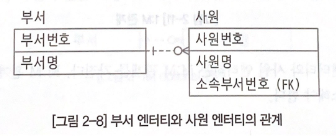

### 2.2.3.1 카디널리티

카디널리티는 하나의 부모 인스턴스가 몇 개의 자식 인스턴스와 페어링 될 수 있는지를 나타낸다. 1:1, 1:M, M:M 관계가 존재한다

### 2.2.3.2 옵셔널리티

옵셔널리티(optionality)는 부모 인스턴스와 자식 인스턴스의 페어링 여부를 나타낸다. 페어링되 어야 하면 필수(mandatory) 관계, 페어링되지 않아도 되면 선택(optional) 관계를 가진다. 3번 부서는 페어링되는 사원 인스턴스가 없으므로 부서 엔터티는 사원 엔터티에 대해 선택 관계를 가지고, 사원 인스턴스는 부서 인스턴스와 모두 페어링되므로 사원 엔터티는 부서 엔터티에 대해 필수 관계를 가진다.

### 2.2.3.3 관계 유형

관계 유형은 식별 관계와 비식별 관계로 구분된다. 부모 엔터티의 기본 식별자가 자식 엔터티 의 기본 식별자 속성으로 상속되면 식별(identifying) 관계, 일반 속성으로 상속되면 비식별(non-identifying) 관계다.
식별 관계는 관계를 실선으로 표시하며, 부모 엔터티와 자식 엔터티가 밀접한(tightly coupled) 관계를 가 진다. 비식별 관계는 관계를 점선으로 표시하며, 부모 엔터티와 자식 엔터티가 느슨한 관계(loosely coupled)를 가진다.

아래 그림은 식별 관계로만 설계한 데이터 모델이다. 자식 엔터티로 갈수록 기본 식별자가 길어지는 것을 확인할 수 있다. 기본 식별자가 길어지면 저장 공간도 늘어나고 SQL도 길어진다.


아래 그림은 비식별 관계로만 설계한 데이터 모델이다. 저장 공간을 최소화할 수 있지만 2단계를 넘어가면 관계가 단절되는 단점이 있다. t1테이블의 a열에 해당하는 t4테이블의 z열을 조회하기 위해서는 4개의 테이블을 모두 조회해야한다. 그림 2-20의 데이터 모델은 t4테이블만 조회하면 된다.

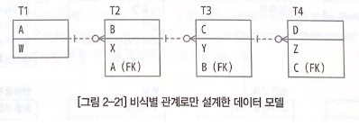

## 2.3 정규형

정규형(Nomal Form. NF)은 데이터 이상(anomaly) 현상을 제거하기 위한 관계형 모델의 설계 지침이다.
	•	1정규형
	•	2정규형
	•	3정규형

### 2.3.2 비정규화

비정규화(denormalization)는 성능 개선을 위해 의도적으로 데이터를 중복시키는 것이다. 정규형 을 위배한 릴레이션은 데이터 무결성을 보장하기 어렵기 때문에 제한적으로 사용하는 편이 바람직하다.

## 2.4 물리데이터 모델

논리 데이터모델은 DBMS에 따른 물리 데이터 모델로 전환된다.

| 논리 데이터 모델 | 물리 데이터 모델 |
| --- | --- |
| 엔터티 | 테이블 |
| 속성 | 열 |
| 도메인 | 데이터 타입, NOT NULL 제약 조건, CHECK제약 조건 |
| 고유 식별자 | PK 제약조건 |
| 외래 식별자 | FK 제약조건 |

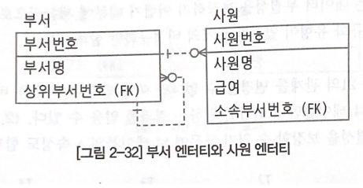

위와 같은 부서 테이블은 아래의 DDL문으로 생성할 수 있다.

```sql
CREATE TABLE 부서 (
	부서번호   NUMBER   NOT NULL
	,부서명    VARCHAR2(10)   NOT NULL
	,상위부서번호   NUMBER   NULL
	,CONSTRAINTS 부서_PK   PRIMARY KEY(부서번호)
	,CONSTRAINTS 부서_F1   FOREIGN KEY(상위부서번호) REFERNCES 부서 (부서번호));
```

사원 테이블은 아래의 DDL문으로 생성할 수 있다.

```sql
CREATE TABLE 사원 (
	사원번호   NUMBER   NOT NULL
	,사원명    VARCHAR2(10)   NOT NULL
	,급여      NUMBER   NOT NULL
	,소속부서코드   NUMBER   NOT NULL
	,CONSTRAINTS 사원_PK   PRIMARY KEY(사원번호)
	,CONSTRAINTS 사원_F1   FOREIGN KEY(소속부서번호) REFERNCES 부서 (부서번호));
```

---

# 3장 오라클 데이터 베이스

## 3.1.2 오브젝트

오브젝트(object)는 논리적인 데이터 구조다. 오브젝트는 사용자(user)에게 종속될 수 있다 사용자에게 종속된 오브젝트의 논리적 집합을 스키마(schema)라고 한다. 스키마는 오브젝트를 소유 한 사용자와 동일한 이름을 가진다. 사용자에 종속된 오브젝트를 스키마 오브젝트, 종속되지 않는 오브젝트를 비 스키마(nonschema)오브젝트라고 한다.

| 구분 | 오브젝트 |
| --- | --- |
| 스키마 오브젝트 | 테이블, 클러스터, 인덱스, 뷰, 시퀀스, 시노님, 오브젝트 타입 |
| 비 스키마 오브젝트 | 사용자, 롤, 디렉터리 |

오브젝트는 데이터 저장여부에 따라 세그먼트 오브젝트와 비 세그먼트 오브젝트로 구분할 수 있다. 저장공간이 필요한 오브젝트를 세그먼트(segment)라고 한다.

| 구분 | 오브젝트 |
| --- | --- |
| 세그먼트 오브젝트 | 테이블, 클러스터, 인덱스 |
| 비 세그먼트 오브젝트 | 뷰, 시퀀스, 시노님, 오브젝트 타입, 사용자, 롤, 디렉터리 |

### 3.1.5 데이터 무결성

데이터 무결성(data integrity)은 데이터의 정확성과 일관성이 유지되고 있는 상태를 의미한다.
데이터 무결성은 개체 무결성(entity integrity), 참조 무결성(referential integrity), 범위 무결성 (domain integrity), 사용자 정의 무결성(user defined integrity)으로 구분된다.

| 무결성 | 설명 |
| --- | --- |
| 개체 무결성 | 엔터티의 인스턴스가 속성이나 속성의 조합으로 식별되어야 함 |
| 참조 무결성 | 자식 엔터티의 외래 식별자가 부모 엔터티의 기본 식별자에 존재해야함 |
| 범위 무결성 | 속성값이 지정한 범위에 유효해야함 |
| 사용자 정의 무결성 | 개체 무결성, 참조 무결성, 범위 무결성에 속하지 않는 무결성 |

| 무결성 | DBMS 기능 |
| --- | --- |
| 개체 무결성 | PK제약조건, UNIQUE 제약 조건, NOT NULL 제약 조건 |
| 참조 무결성 | FK제약 조건, 트리거 |
| 범위 무결성 | 데이터 타입, 기본값, CHECK제약 조건 |
| 사용자 정의 무결성 | 트리거 |

트랜잭션은 ACID라는 네 가지 특징을 가지고 있다. 자세한 내용은 19장에서 살펴보자.

| 특징 | 설명 |
| --- | --- |
| 원자성 | 트랜잭션의 작업은 모두 수행되거나 모두 수행되지 않아야 함 |
| 일관성 | 트랜잭션이 완료되면 데이터 무결성이 일관되게 보장되어야 함 |
| 격리성 | 트랜잭션이 다른 트랜잭션으로부터 격리되어야 함 |
| 지속성 | 트랜잭션이 완료되면 장애가 발생하더라도 변경 내용이 지속되어야 함 |

### 3.1.7 정적 데이터 딕셔너리 뷰

정적 데이터 딕셔너리 뷰는 데이터베이스의 메타데이터를 조회할 수 있는 읽기 전용 뷰다. 정적 데이터 딕셔너리 뷰와 뷰의 기본 테이블은 SYS 사용자가 소유하고 있다. 기본 테이블을 SYSTEM테이블스페이스에 저장된다.

| 접두어 | 사용 | 오브젝트 |
| --- | --- | --- |
| DBA_ | 데이터베이스 관리자 | 모든 오브젝트 |
| ALL_ | 모든 사용자 | 사용자에게 권한이 있는 오브젝트 |
| USER_ | 모든 사용자 | 사용자가 소유한 오브젝트 |

### 3.1.8 동적 성능뷰

동적 성능뷰는 데이터베이스의 동적 정보를 조회할 수 있는 읽기 전용 뷰다. 동적성능뷰는 V$로 시작하며 X$로 시작하는 동적 성능 테이블을 사용한다. 동적 성능 테이블은 SYS 사용자가 소유하고 있다.

## 3.2 구조

| 항목 | 오라클 데이터베이스 | 엑셀 |
| --- | --- | --- |
| 파일 | data file, control file, online redo log | excel file |
| 메모리 | SGA, PGA | cache |
| 프로세스 | background process, server process | process, thread |
| 프로그램 | oracle database | office |
| 운영체제 | unix, linux, window | windows |

| 순서 | 상태 | 설명 | 관련파일 |
| --- | --- | --- | --- |
| 1 | SHUTDOWN | 인스턴스가 없음 |  |
| 2 | NOMOUNT | 인스턴스가 시작됨 | parameter file |
| 3 | MOUNT | 데이터베이스의 상태를 검사 | control file |
| 4 | OPEN | 데이터베이스가 열림 | data file, online redo log |

### 3.2.1 데이터베이스와 인스턴스

오라클 데이터베이스는 하나의 데이터베이스와 하나 이상의 인스턴스로 구성된다. 데이터베이스는 데이터를 저장하는 파일의 모음이다. 인스턴스는 SGA와 백그라운드 프로세스로 구성된다.

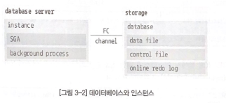

하나의 데이터베이스와 하나의 인스턴스로 구성된 오라클 데이터베이스를 single 서버라고 한다. 고가용성(High Availability, HA)과 성능 향상을 위해 오라클 데이터베이스를 RAC(Real Application Clusters)로 구성할 수 있다. RAC는 하나의 데이터베이스와 2개 이상의 인스턴스로 구성된다.

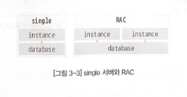

SGA는 아래와 같은 메모리 구조를 가진다. shared pool은 library cache와 data ditctionary cache를 포함한다.

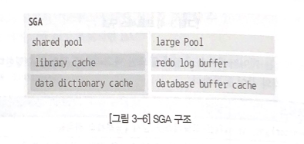

| SGA | 설명 |
| --- | --- |
| database buffer cache | data file에서 읽은 data blick의 복사본을 캐싱하고 변경을 기록 |
| redo log buffer | DB의 변경사항을 online redo log파일에 기록하기전에 버퍼링 |
| shared pool | 다양한 유형의 프로그램 데이터를 캐싱 |
| library cache | 실행가능한 SQL, PL/SQL코드를 저장 |
| data dictionary cache | 데이터 딕셔너리 정보를 캐시 |
| large pool | shared pool보다 큰 메모리를 할당하기 위한 영역 |

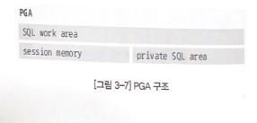

### 3.2.4 저장 구조

오라클 데이터베이스는 물리 저장 구조와 논리 저장 구조가 분리되어 있다. 물리 구조를 변경해도 논리 구조에 영향을 주지 않는다.

### 3.2.4.1 물리 저장 구조

물리 저장 구조(physical storage structure)는 파일로 저장되며 OS에서 확인할 수 있다. archived redo log 파일처럼 데이터베이스에 속하지 않는 파일도 존재한다.

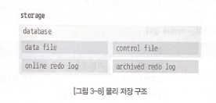

| 파일 | 설명 |
| --- | --- |
| data file | 세그먼트(테이블 인덱스)가 저장되는 파일 |
| control file | 데이ㅓ베이스의 물리적인 구성요소에 대한 제어파일 |
| online redo log | 데이터베이스의 변경 사항을 저장하는 파일 세트 |
| archived redo log | online redo log의 오프라인 사본 |

### 3.2.4.2 논리 저장 구조

논리 저장 구조(logical storage structure)는 오라클 데이터베이스 내부에서 관리된다. 논리 저장 구조와 물리 저장 구조는 아래의 관계를 가진다. 세그먼트는 하나의 테이블스페이스에 속하고, 다수의 데이터 파일에 저장될 수 있다.

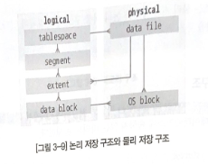

| 단위 | 설명 |
| --- | --- |
| 블록 (data block) | 데이터를 저장하는 가장 작은 노리적 단위 |
| 익스텐트 (extent) | 논리적으로 연속된 data block의 집합 (공간을 확장하는 단위) |
| 세그먼트 (segment) | 오브젝트에 할당된 extent의 집합 |
| 테이블스페이스 (tablespace) | 세그먼트를 포함하는 데이터베이스 저장 단위 |

### 3.2.5 네트워크 구조

오라클 데이터베이스는 아래와 같은 네트워크 구조를 가진다. 리스너(listener)는 데이터베이스 서버에서 동작하는 프로그램으로 오라클 데이터베이스의 접속을 처리한다. listener.ora 파일은 리스너의 설정 파일이다. tnsnames.ora 파일은 클라이언트의 설정 파일로 데이터베이스 서버의 접속 정보가 저장된다.

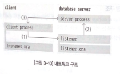

리스너의 방식의 접속은 아래의 순서로 진행된다

1. 클라이언트 프로세스가 데이터베이스 서버에 접속을 요청
2. 리스너가 클라이언트 프로세스의 접속 요청을 수락하고 서버 프로세스를 생성
3. 리스너가 서버 프로세스와 클라이언트 프로세스를 연결한 후 다른 접속 요청을 대기 

커넥션과 세션은 혼동하기 쉬운 개념이다. 커넥션(connection)은 클라이언트 프로세스와 데이터베이스 인스턴스 사이의 물리적 통신 경로, 세션(Session)은 데이터베이스에 로그인 한 사용자의 상태를 나타내는 논리적 객체다. 커넥션을 통해 세션이 생성된다.

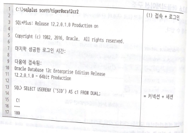

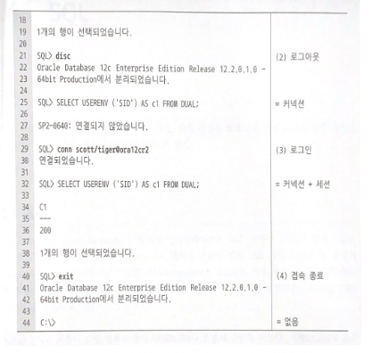

---

# 4장 SQL

### 4.4 처리 과정

SQL은 아래와 같은 과정으로 처리된다. syntax check, semantic check, shared pool check 의 과정을 파싱이라고 한다. optimization과 row source generator 과정까지 거치는 것을 hard parse, share pool에 저장된 커서를 바로 수행하는 것을 soft parse라고 한다.

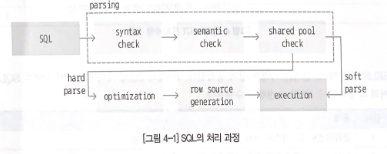

| 과정 | 설명 |
| --- | --- |
| syntax check | SQL의 문법을 검사 |
| semantic check | 오브젝트와 권한의 존재 유무를 검사 |
| shared pool check | shared pool의 library cache에 SQL이 저장되어 있는지 검사 |
| optimization | SQL의 쿼리 변환과 최적화를 수행 |
| row source generator | SQL 엔진에 의해 수행될 프로그램 소스를 생성 |

## 4.5 수행과정

SELECT문은 아래의 과정으로 수행된다.

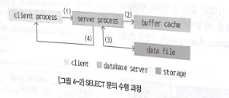

1. 클라이언트 프로세스가 서버 프로세스로 SELECT문을 전달
2. buffer cache에 필요한 데이터 블록이 있는지 확인
3. 없으면 data file에서 데이터 블록을 읽어 buffer cache에 저장
4. 결과 집합을 클라이언트 프로세스에 전달

---

# 5장 SELECT 문

SQL Plus의 DRSCI[RIBE] 명령어로 테이블의 열 정보를 확인할 수 있다. 명령어 우측에 테이블 명을 기술하면 된다. 

### 5.1.3 열 별칭

별칭은 대소문자를 구분하지 않고, 숫자로 시작할 수 없으며, 공백이나 특수 문자 (#, S,_는 제외)를 포함할 수 없다. 별칭을 큰 따옴표(“)로 감싸면 제약을 회피할 수 있다.

> expr [[AS] c_alias]
> 

10.1 버전부터는 새로운 방식의 문자 리터럴을 사용할 수 있다. quote_delimiter는 [], {}, <>, ()등을 사용할 수 있다.

> {Q | a} 'quote_delimiter c[c] quote_delimiter'
> 

DUAL 테이블은 dummy 열로 구성되며, 1개의 행을 가지고 있다. DUAL 테이블은 리터럴 조회, 행 복제 등 다양한 용도로 활용할 수 있다. SELECT 절에 애스터리스크나 dummy 열을 기술하면 쿼리의 성능이 저하될 수 있다.

### 5.3.1.4 인터벌 리터럴

인터벌 리터럴은 시간의 간격을 지정한다. YEAR TO MONTH, DAY TO SECOND 리터럴 사용할 수 있다.

### 5.2.3 SAMPLE 절

SAMPLE절을 사용하면 테이블을 샘플링하여 조회할 수 있다. 대용량 테이블에 대한 통계 값을 생성할 때 활용할 수 있다.

> SAMPLE [BLOCK] (sample_percent) [SEED (seed_value)}
> 

| 항목 | 설명 |
| --- | --- |
| BLOCK | 블록 샘플링을 사용 (지정하지 않으면 로우 샘플링) |
| sample_percent | 샘플링 비율 (0.000001 ≤ sample_percent <100) |
| SEED (seed_value) | 항상 동일한 샘플을 반환 (seed_value는 0~4294967295 범위의 정수) |

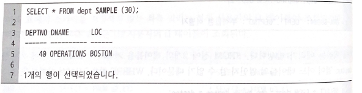

- `COL[UMN]` 명령어
    
    : `COL[UMN]` 명령어로 열 포맷을 설정할 수 있다. 아래와 같이 `FOR[MAT]` 옵션을 사용하면 된다
    

> COL[UML] colunm FOR[MAT] format
> 

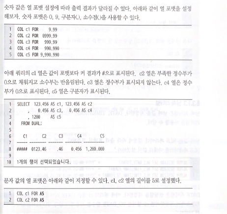

### 5.3.1.3 날짜 리터럴

날짜 값은 NLS 파라미터 설정에 따라 출력 포맷이 결정된다. 날짜 값의 출력 포맷과 관련된 NLS 파라미터를 아래와 같이 설정하자

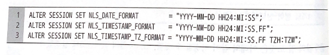

YEAR TO MONTH 리터럴은 년에서 월까지의 간격을 지정할 수 있다. precision의 범위는 0 ~ 9, 기본값은 2다.

> INTERVAL 'integer [- integer]' {YEAR | MONTH} [(precision)] [TO {YEAR | MONTH}]
> 

날짜 값의 월 연산은 ADD MONTHS 함수를 사용해야 한다. 

> SELECT ADD_MONTHS (DATE '2050-01-31', 1) AS C1 FROM DUAL;
> 

- 단순 CASE 표현식
    
    단순 CASE 표현식은 expr과 comparison_expr이 일치하는 첫번째 return_expr, 일치하는 comparison_expr이 없으면 else_expr을 반환한다
    
    ```sql
    CASE expr
    	{WHEN comparison_expr THEN return_expr} ...
    	[ELSE else_expr]
    END
    ```
    
    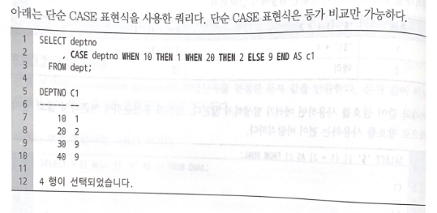
    
    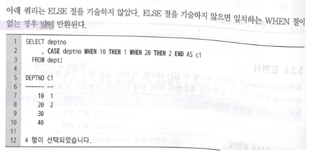
- ROWID는 데이터베이스에서 행을 식별할 수 있는 고유 값이다. 오브젝트, 파일, 블록, 행번호의 조합으로 계산된다.
    
    
    | ROWID | 자릿수 | 의미 |
    | --- | --- | --- |
    | AAAWk8 | 6 | 데이터 오브젝트 번호 |
    | AAJ | 3 | 상대적 파일 번호 |
    | AAAACE | 6 | 블록 번호 |
    | AAA | 3 | 블록 내의 행 번호 |

## 5.4 바인드 변수

SQL도 바인드 변수를 사용할 수 있다. 바인드 변수를 사용하면 쿼리의 재사용성을 높일 수 있다

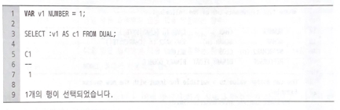

`EXEC[UTE]`명령어를 사용하면 바인드 변수에 새로운 값을 할당 할 수 있다.

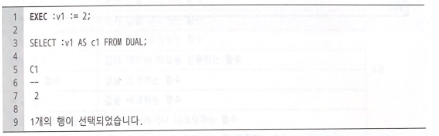