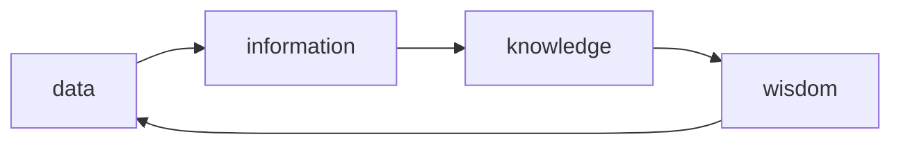

# 데이터
## 데이터
### 정형, 비정형, 빅데이터
- 빅 데이터는 기존의 기술로 분석하기 어려웠던 대용량 정형 데이터 뿐만 아니라 분석 대상이 아니었던 비정형 데이터를 분석하기 위한 기술의 총체.
- 빅데이터가 정형 데이터를 대체하는 기술로 이해해서는 안 된다.

### 정보와 지식
- 데이터를 분석하여 정보를 생성
- 정보를 해석하여 지식이 축적
- 축적된 지식은 지혜가 됨
- 지혜를 실천하면 새로운 데이터가 형성됨

### Information Technology
- 과거의 IT 는 <ins>데이터</ins>를 가공하여 <ins>정보</ins>를 만들어내는 역할, <ins>지식</ins>과 <ins>지혜</ins>는 데이터와 정보를 분석하는 인간의 역할
- 최근의 IT 는 기계 학습 등의 기술을 통해 지식과 지혜를 만들어내는 수준으로 발전.

## 데이터베이스
### 관계형 모델에 대한 오해
- "Relational Model"은 "Relation"에 데이터를 저장한다.
  - Relation: 집합론에서 곱집합의 부분집합을 의미
  - 릴레이션은 튜플(Row)의 집합이며 튜플은 속성(Column)의 집합이다.

### 데이터베이스의 역사
- 관계형 모델을 채택한 관계형 데이터베이스가 주류.
- 객체-지향 데이터베이스 등장했지만 시장 호응이 없었음.
- 최근엔 객체-관계형 데이터베이스가 주류
- NoSQL: 관계형보다 느슨한 일관성 모델을 채택.

## 데이터베이스 시스템
- 데이터베이스를 관리하기 위한 응용 프로그램
- Oracle, MySQL, PostgreSQL / MongoDB, Cassandra, Redis

## IT 시스템
> 데이터의 발생 유형과 사용 목적에 따라 IT 시스템이 구분된다.
> 운영 시스템에서 데이터 발생 -> EDW 를 거쳐 -> BI 로 이동.
### 운영 시스템 (기간계)
- 기업 운영에 필요한 데이터 관리
- 종류
  - OLTP(OnLine Transaction Processing)
### EDW (정보계)
- Enterprise Data Warehouse. 분석에 필요한 데이터 저장
- 종류
  - ODS(Operational Data Store): 운영 데이터 원본 형태로 보관
  - DW(Data Warehouse): 운영 데이터를 통일된 형식으로 저장
  - DM(Data Mart): DW 데이터를 사용 목적에 따라 요약
### BI
- Business Intelligence: 기업의 효율적 의사 결정을 지원
- 종류
  - OLAP(OnLine Analytical Processing): DW 데이터를 분석